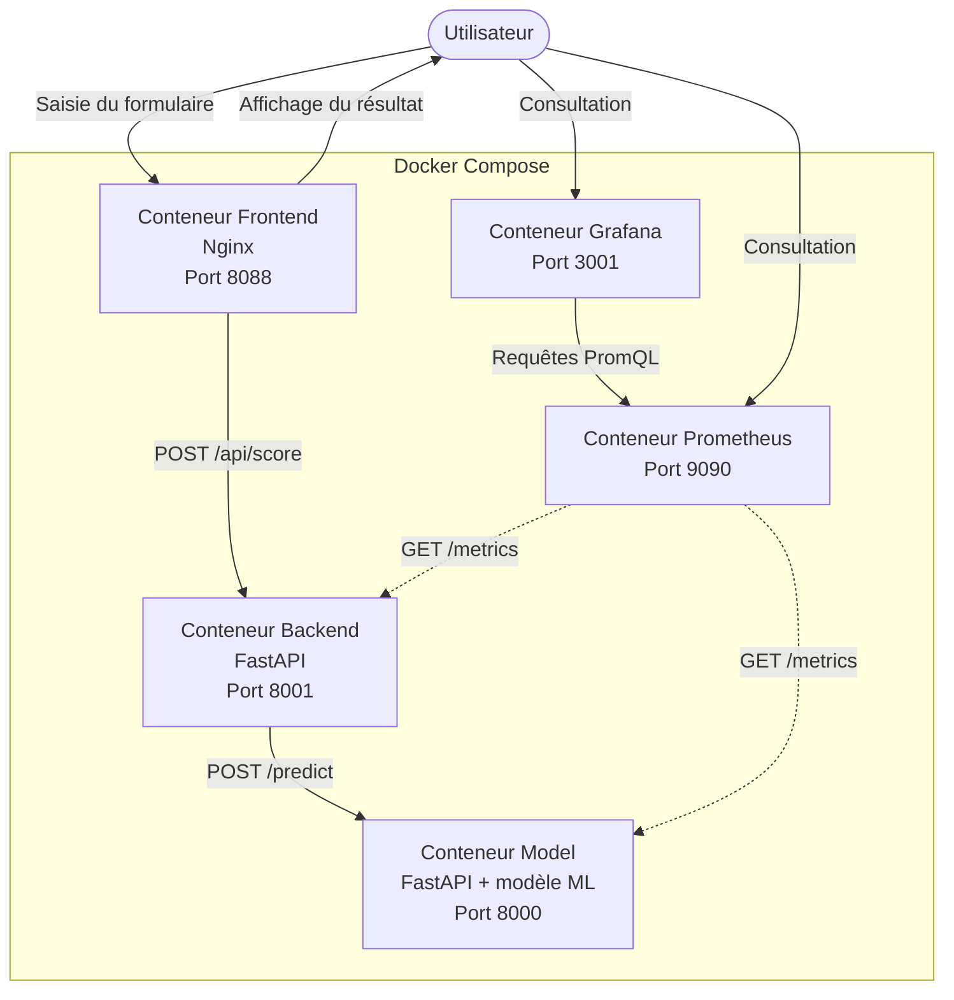
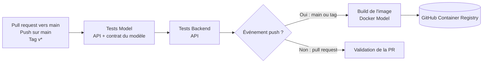

# M5-B1 + M5-B2 — Pyrenex Prod (architecture, CI/CD, monitoring, éval continue)

Pyrenex Prod est une application de scoring de risque crédit composée de trois services applicatifs conteneurisés : une interface web statique servie par nginx, une API backend FastAPI et une API FastAPI dédiée au modèle de machine learning. Prometheus collecte leurs métriques et Grafana fournit un dashboard de supervision provisionné automatiquement.

## Démarrage

### Prérequis

- Docker avec Docker Compose ;
- Python 3.11 ou supérieur pour exécuter les tests localement.

### Lancer l'application

```bash
docker compose up --build -d
docker compose ps
```

Les trois services applicatifs possèdent un healthcheck. Lorsque `model` est sain, le backend démarre ; lorsque le backend est sain, le frontend démarre.

Pour consulter les logs ou arrêter l'application :

```bash
docker compose logs -f
docker compose down
```

### Accès locaux

| Composant | Adresse | Rôle |
|---|---|---|
| Frontend | <http://localhost:8088> | Formulaire de scoring |
| API model | <http://localhost:8000/docs> | API interne de prédiction |
| API backend | <http://localhost:8001/docs> | Orchestrateur exposé au frontend |
| Prometheus | <http://localhost:9090> | Collecte et interrogation des métriques |
| Cibles Prometheus | <http://localhost:9090/targets> | État du scraping des API |
| Grafana | <http://localhost:3001> | Dashboard de supervision |

Grafana utilise les identifiants locaux `admin` / `admin`. Le dashboard **Pyrenex Prod** est chargé automatiquement depuis le dépôt.

## Tests

Créer l'environnement Python et installer les dépendances de développement :

```bash
python -m venv .venv
source .venv/bin/activate
pip install -r requirements-dev.txt
pip install -r services/backend/requirements.txt
```

Lancer tous les tests :

```bash
pytest -v
```

Les tests couvrent les endpoints de santé, la validation des demandes, le scoring et le contrat technique du modèle sérialisé.

## Architecture



## Services

### Frontend

Le frontend est une page statique servie par nginx. Il fournit le formulaire de demande de crédit et transmet les appels `/api/` au backend via un reverse proxy. Le navigateur n'appelle donc pas directement le service model.

### Backend

Le backend FastAPI valide les entrées avec Pydantic et expose :

- `GET /health` : état du backend ;
- `POST /score` : transmission d'une demande validée au modèle ;
- `GET /metrics` : métriques HTTP et métier au format Prometheus.

Il propage un identifiant de requête au service model. Un modèle injoignable produit une réponse `503`, tandis qu'une erreur HTTP du modèle produit une réponse `502`. Ces événements alimentent le compteur `backend_upstream_errors_total`, avec les labels `unreachable` et `http_error`.

### Model

Le service model charge le pipeline scikit-learn au démarrage et expose :

- `GET /health` : disponibilité du modèle chargé ;
- `GET /info` : version, provenance et métriques du modèle ;
- `POST /predict` : classe de risque et probabilité de défaut ;
- `GET /metrics` : métriques HTTP et métriques de prédiction.

Les métriques métier `pyrenex_predictions_total` et `pyrenex_prediction_proba` décrivent respectivement la distribution des classes prédites et celle des probabilités de défaut.

## Modèle de scoring

Le modèle embarqué est `pyrenex_risk_v2`, version `v2.0.0`. Il provient du projet M1-B1, puis a été intégré à l'API M1-B2 avant d'être repris dans cette application. La configuration retenue, `balanced_shallow`, est un Random Forest équilibré de 100 arbres, limité à une profondeur de 6, avec `min_samples_leaf=10`.

Le pipeline a été entraîné avec scikit-learn `1.5.1`. Les artefacts indissociables sont versionnés dans `services/model/models/` :

- `pyrenex_risk_v2.joblib` : pipeline de prétraitement et modèle entraîné ;
- `pyrenex_risk_v2.json` : version, variables, hyperparamètres, empreinte du dataset et résultats d'évaluation.

Résultats sur le holdout final de 6 000 demandes jamais utilisées pour sélectionner le modèle :

| Métrique | Valeur |
|---|---:|
| F1 macro | 0,5994 |
| F1 défaut | 0,4299 |
| ROC-AUC | 0,7307 |
| Recall défaut | 0,6745 |
| Précision défaut | 0,3155 |
| Accuracy | 0,67 |

Matrice de confusion au seuil de décision `0,5` :

|  | Prédit remboursé | Prédit défaut |
|---|---:|---:|
| Vrai remboursé | 3 283 | 1 614 |
| Vrai défaut | 359 | 744 |

Le recall défaut élevé a motivé ce choix : le modèle détecte environ 67 % des défauts réels, au prix d'un nombre plus important de faux positifs.

## Monitoring

Prometheus interroge toutes les cinq secondes les endpoints `/metrics` du backend et du modèle. La métrique `up` indique si chaque cible est joignable, y compris lorsqu'un service arrêté ne peut plus publier ses propres compteurs.

Grafana utilise Prometheus comme datasource et charge automatiquement le dashboard `grafana/provisioning/dashboards/pyrenex_prod.json`. Son rafraîchissement est configuré à cinq secondes.

| Panel | Métrique exploitée | Lecture |
|---|---|---|
| Trafic : requêtes par seconde | `http_requests_total` | Débit métier du backend et du modèle, hors `/health` et `/metrics` |
| Fiabilité : erreurs d'appel au modèle | `backend_upstream_errors_total` | Taux d'erreurs réseau et HTTP entre le backend et le modèle |
| Vie : services disponibles | `up` | `1` si Prometheus joint le service, `0` en cas de panne |
| Vitesse : latence p95 | `http_request_duration_seconds_bucket` | Durée sous laquelle se terminent 95 % des requêtes |
| Comportement : distribution des prédictions | `pyrenex_predictions_total` | Évolution des classes « défaut » et « pas défaut » |

Le panel de trafic exclut les appels techniques de Prometheus et des healthchecks afin de représenter uniquement les requêtes applicatives. Le panel de disponibilité repose sur `up`, car un service arrêté ne peut plus publier lui-même ses compteurs.

## CI/CD



Le workflow `.github/workflows/ci.yml` s'exécute sur les pull requests vers `main`, les push sur `main` et les tags commençant par `v`.

Le job `test` installe séparément les dépendances des services model et backend, puis exécute leurs suites pytest. Le job `build-and-push` dépend de sa réussite : si un test échoue, aucune image n'est publiée.

Après un push ou un tag valide, l'image du service model est construite et publiée dans GitHub Container Registry :

```text
ghcr.io/jeremy-formation-ia/m5-b1-model:<branche-ou-tag>
```

## Structure du dépôt

```text
.
├── .github/workflows/
│   └── ci.yml                         # Tests, build et publication GHCR
├── grafana/provisioning/
│   ├── dashboards/
│   │   ├── dashboards.yml             # Provider de dashboards
│   │   └── pyrenex_prod.json          # Dashboard Pyrenex provisionné
│   └── datasources/
│       └── datasource.yml             # Datasource Prometheus
├── prometheus/
│   └── prometheus.yml                 # Scraping backend et model
├── services/
│   ├── backend/
│   │   ├── app/                       # API d'orchestration FastAPI
│   │   ├── tests/                     # Tests du backend
│   │   ├── Dockerfile
│   │   └── requirements.txt
│   ├── frontend/
│   │   ├── html/                      # Formulaire et styles
│   │   ├── Dockerfile
│   │   └── nginx.conf                 # Serveur statique et reverse proxy
│   └── model/
│       ├── app/                       # API de prédiction et métriques
│       ├── models/                    # Modèle v2 et métadonnées
│       ├── tests/                     # Tests API et contrat du modèle
│       ├── Dockerfile
│       └── requirements.txt
├── docker-compose.yml                 # Orchestration des cinq services
├── requirements-dev.txt               # Dépendances de test et d'évaluation
└── runbook.md                          # Procédures opérationnelles
```
